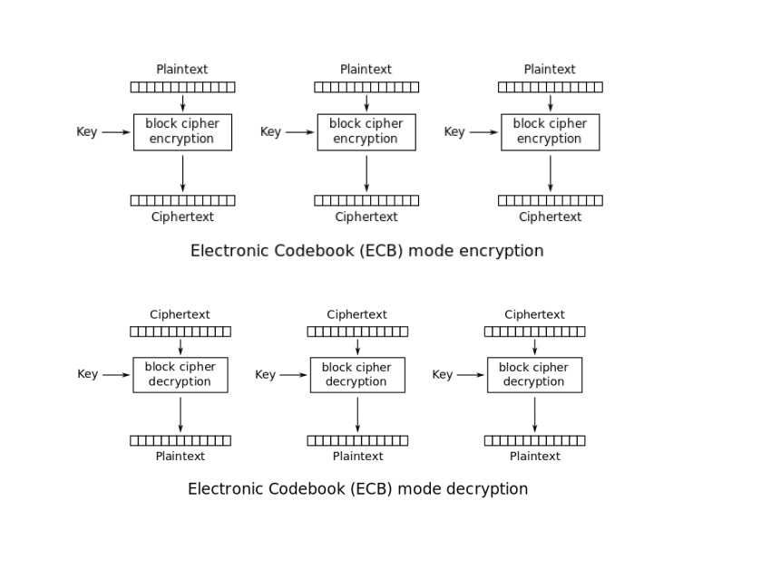
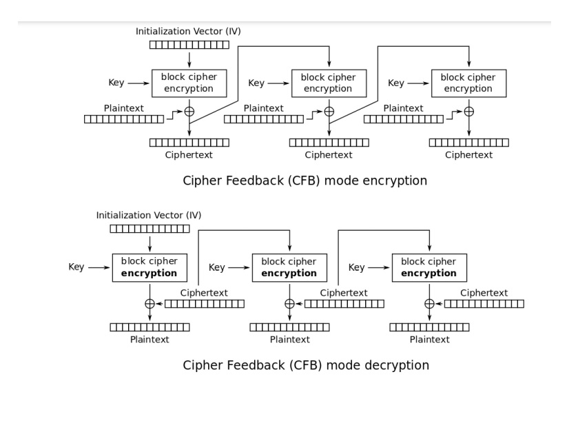

# tema 1-SI
# Izmana Iuliana-b6

tema este realizata pe windows in python folosind PyCharm si contine fisierele: KM.py (key manager), A.py (nodul A), B.py (nodul B), plaintext.txt 

# Executare
* pentru a putea executa este nevoie de: 
   python 3.9 instalat  
   comanda: "pip3 install pycryptodome" rulata in directorul proiectului  

* ordinea in care se ruleaza sursele python: 
   KM.py  
   A.py  
   B.py  

# Functionare
Nodurile A si B se conecteaza la KM si trimit modul de operare ales(ECB sau CFB).
KM verifica daca modurile coincid, daca da acela va fi modul de criptare, daca nu, se va alege unul in mod random. KM transmite nodurilor modul de criptare.
KM trimite nodurilor cheia(+ vector de initializare),asteapta mesajul de confirmare, apoi trimite un mesaj de incepere al comunicarii intre A si B.

Nodul A imparte fisierul in blocuri pe care le trimite nodului B, criptate in modul ales. La fiecare 8 blocuri trimise nodul A trimite un mesaj lui KM si asteapta raspunsul acestuia pentru a continua trimiterea.

Nodul B primeste blocurile, le decripteaza si la final afiseaza plaintextul.
La fiecare 8 blocuri primite nodul B trimite un mesaj lui KM si asteapta raspunsul acestuia pentru a continua decriptarea.

# Moduri de criptare
 * ECB
 
 
 * CFB
 

